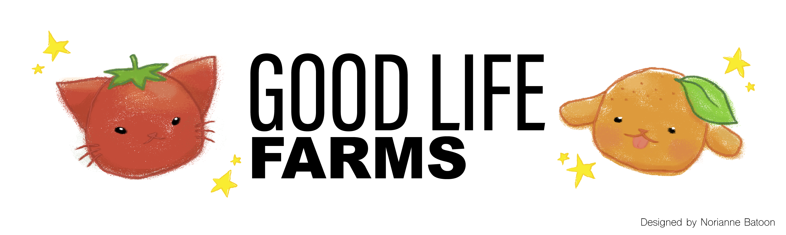

<br>
<br>

<p align="center">
  <a href="https://GoodLifeFarms.nsustain.com/">
  
  </a>
</p>

<br>

## 2024-02-16

```bash
# Initialized our web app as a Next.js project.
pnpm create next-app good-life-farms

# Background color gradient was based on Tailwind UI:
#   https://tailwindui.com/components/marketing/sections/heroes

# Color palette was generated using Colorhunt.co:
#   https://coolors.co/366345-b8b42d-6a3937-fffcf1-f4f4f8

# Main package we relied on:
#   https://theoephraim.github.io/node-google-spreadsheet/

# If using VS Code, recommended to install the Prettier extension:
#   https://marketplace.visualstudio.com/items?itemName=esbenp.prettier-vscode

# Google Sheets icon source:
#   https://simpleicons.org/?q=sheets
```

<br>

## 2024-02-18

After 36 hours of sleepless nights at TreeHacks, we finished our prototype!


 <br>

<br>

## 2024-10-12

### Procedures for Adding a New Local Producer

```bash
# TODO: Document procedures with local producers.
# It will be nice to have as much of this automated as possible.
# Maybe, start as a bash script and scale up?
cd GoodLifeFarms/src
cp components/... ...

# TODO: Delete this comment once documentation is complete.
# For real local producers page, top center = local producer name.
# Edit in Sheets is needed only in the prototype page.
```

<br>
