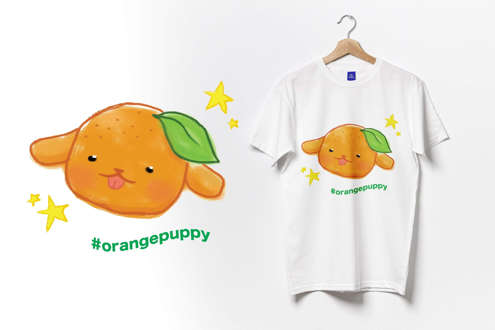
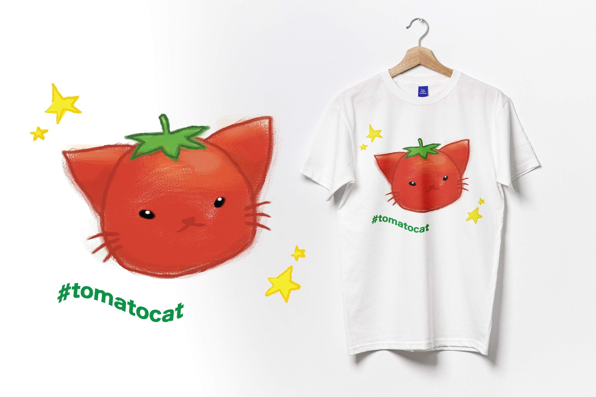

 

## What we are not

We are not a marketplace app like Ebay or Amazon.
We make a single web page for each local producer with the aim of making it as self-sustainable and low-maintenance as possible.

We avoid fancy, expensive technology at all costs, and in fact, we provide our volunteering service for free for all local producers.
To achieve this, we didn't use any dedicated database or cloud infrastructure services to build our web app because they're expensive to maintain.
Instead, our web app is built solely using free services provided by Google (Sheets, Forms, etc).
Thus, it's free for us to maintain Good Life Farms aside from hosting our server, and therefore, we don't have to charge any of our users.
We envision to be Vercel for local producers -- providing a completely free service to anyone who needs it.
If you need millions or billions of rows of data that cannot be handled effectively by our existing, free Google Sheets back-end infrastructure, then you can migrate to proprietary services like Shopify.

 

## What we can do for you

We are volunteers who love the environment and sustainability, and we believe helping local producers and local consumers thrive is one of the best ways we can actually make an impact on environmental sustainability.
We work on this in our free time, so we can't guarantee a timeline, but we can definitely promise to complete the request you submit here.

After you submit this form to us, we will create a page at Good Life Farms, which will have a url like this: https://GoodLifeFarms.nsustain.com/list/prototype
The word "prototype" will be replaced with your desired display name you submit.

We will then send you an invite to your own Google Sheets.
This is how you'll be able to edit what's going to be shown on your page that we will have created for you.
There, you have an option to enter the name of the item(s), their price, and their description.
Whatever you enter there, it will be shown to your new Good Life Farms page in real time.
Since we built our web app entirely using free services, the data update might sometimes be sluggish.
In that case, please refresh your page, and it will most likely work again.

Also, it's up to you, the local producer, to decide on the payment and delivery logistics.
We will not implement a payment processor (PayPal, Stripe, etc) on our web app because that requires us to take constant care of transactions and sensitive user data, which means our project won't be low-maintenance anymore.

You can then share your web page with your fellow local consumers.
They'll be able to see exactly the same things you see on your screen, including the name, price, and description of each item you entered on your Google Sheets.
They'll be able to make an order through your web page by clicking the order buttons.

 

## Who are we?

It was in 2023 when we met Dr. Gubbels, Biology professor at Augustana University, who has a farm in Canton with her husband.
She calls it Good Life Farms.
She told us, "it would be great to have an app for our shareholders," and that's how this project started.

Soobin then met Kathy and Tobi at 2024 Standford Hackathon (TreeHacks) and created the first version of Good Life Farms.
Eight months later, we met Norianne and recruited her to be our Lead Designer.

 

## Logos

These logos were created by our Lead Designer Norianne Batoon, whom I met in *Graphics Design* class in my last semester of college (Fall, 2024).
The moment I saw her design (we just had learned how to use Adobe Illustrator and we were going around in turn presenting our designs), I knew I had to recruit her.
She was the perfect designer for our project because (a) Dr. G has a lot of farm cats, so I tried making a cat logo but could not because making a logo is too difficult for me, and (b) Norianne's design consists of cats and puppies; and veggie and fruit at the same time, which are exactly the two things that Good Life Farms needs in a logo.

[***Insert the final version of the logo here***]

This is the final version of the logo she created with the help of Professor Izia Lindsay, and is also what you will see when you go to https://GoodLifeFarms.nsustain.com

 
